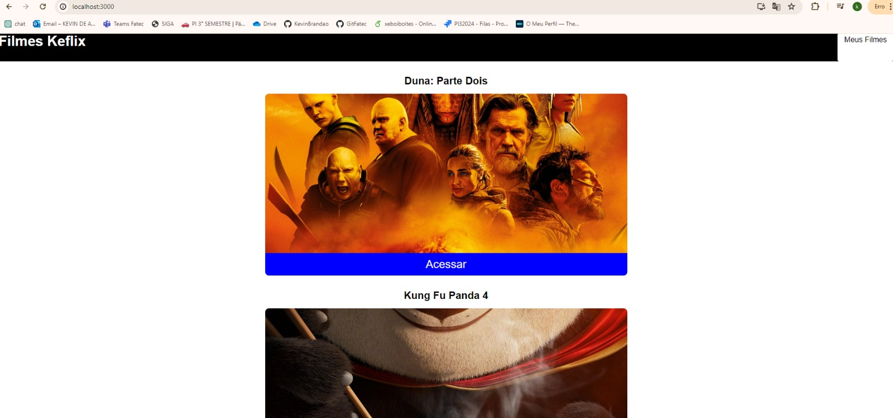
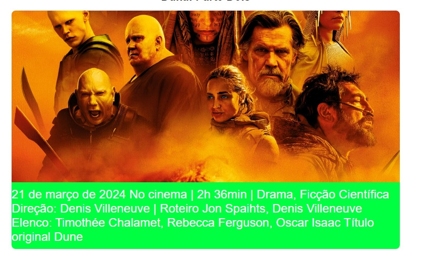
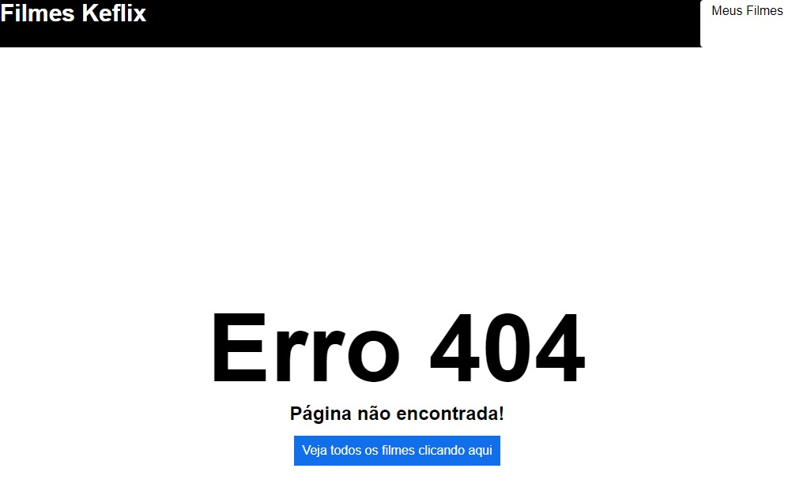
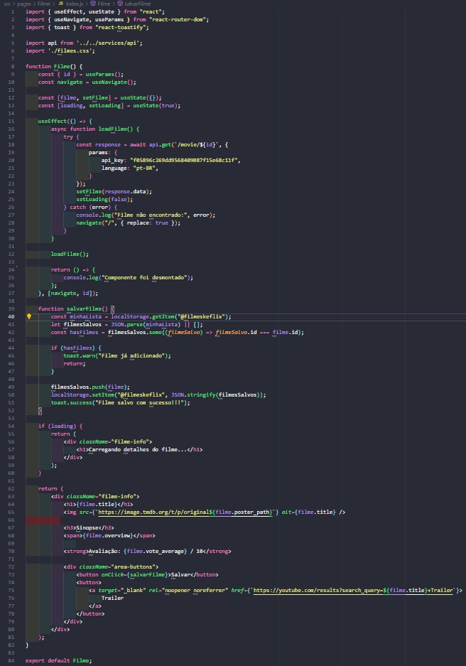

# PROJECT: FILMES KEFLIX
## Link do site
### https://profound-capybara-a532ca.netlify.app/

## Sobre o projeto
È uma aplicação feita totalmente em React
utilizando uma api que busca filmes principalemente filmes em cartas 
ainda, esse será o prototipo inicial com a V1, trazendo principalmente os 
filmes e sua sinopse.

## Sobre a API utilizada saiba mais.
https://api.themoviedb.org/

## Pacotes e Componentes Instalados
 
1- Precisa ter instalado o React
2- NODE
3- NPM
4- npm install react-router-dom
5- npm install -g serve
6- npm i --save react-toastify

## Para rodar a aplicação
### `npm start`

Executa o aplicativo no modo de desenvolvimento.
Abra http://localhost:3000 para visualizá-lo em seu navegador.

A página será recarregada quando você fizer alterações.
Você também pode ver erros de lint no console.

## Imagens da aplicação rodando

